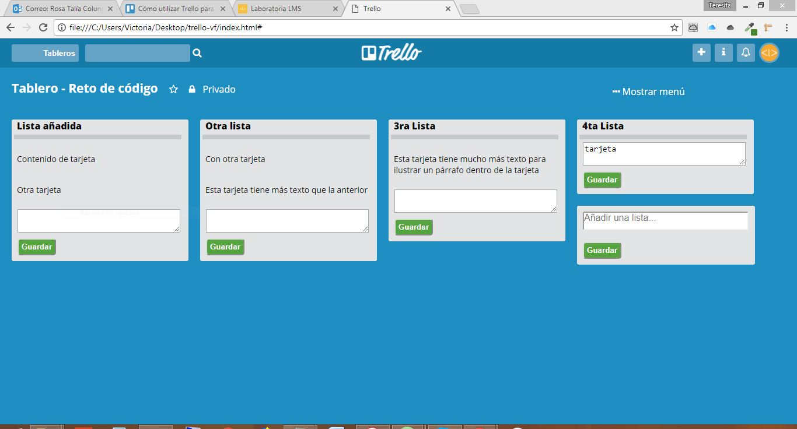

# Trello

## Instrucciones
En este reto, vamos a replicar el tablero de **Trello** como se muestra en la siguiente imagen, con opción a tomar como referencia el sitio original:

  

## Estructura del proyecto:

1. El proyecto se encuentra en una carpeta general llamada Ejercicio Trello la cual está estructurada con 3 carpetas internas, una carpeta de Assets donde se encuentra una carpeta de images, hay otra carpeta de Css que contiene el archivo de estilos del sitio, otra carpeta de JS donde se encuentra nuestro archivo de Javascript, y por último nuestra carpeta de vistas.

2. Dentro de la carpeta general támbien se encuentra un index.html que esta enlazado con un archivo style.css y de Js que se encuentran en las carpetas correspondientes.

## Estructura HTML:

1. Nuestra web esta conformada por *2 secciones* de base que se van incrementando dinamicamente con JS conforme vamos ingresando información:

  i. *El Nav*: Sección donde se encuentra el menú de Tableros, input de busqueda, y el nombre del programa en la parte central. Y del lado izquierdo se encuentran 4 secciones pequeñas ilustradas con iconos y una imagen del perfil del usuario. Esta sección solo tiene estilos con CSS no cuenta con ninguna funcionalidad por el momento.

  ii. *La sección 2¨*: Esta sección tiene un contenedor en donde podemos ir ingresando elementos en forma de lista dinamicamente y podemos ir agragando otros contenedores con otras listas adentro, todo esto a traves de *JS*.  

## Diagrama de Flujo

  

## Rusultado

